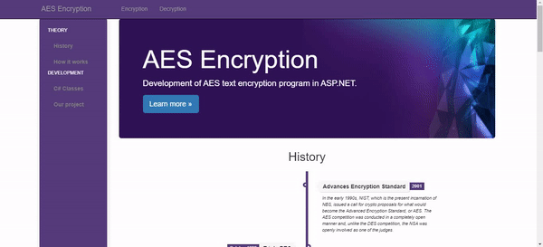
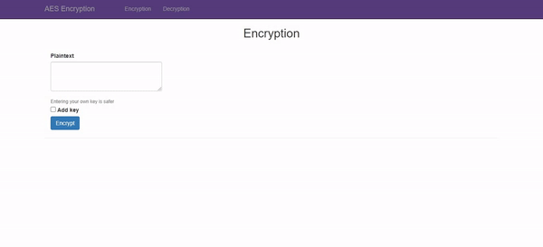
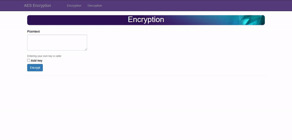
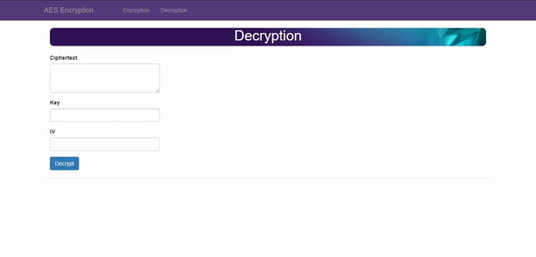

# AES Encryption

This project was made for assignment 1 in the course "Information Security" - Development of AES text encryption program in ASP.NET.

## Functionality

In this application is implemented AES (Advanced Encryption Standard) encryption algorithm. The two main functions that have been developed are text encryption and decryption.

Encryption has three possibilities:

- Only plaintext is given to be encrypted - In this case an encryption key and an initialization vector are generated which are used in the encryption function. The used key and IV are shown to the user.

- Plaintext and encryption key are given - If the key has adequate length for the AES algorithm is used as such, otherwise its hash is generated so that for any type of input the key used in the algorithm has a fixed length acceptable for AES. An initialization vector is generated and attached to the encryption function. The IV used is shown to the user.

- Plaintext, key and initialization vector are given - If key and IV have adequate length for AES algorithm, they are used as provided by the user, otherwise key hash and IV hash are generated so that for any key and IV input are used their acceptable lengths for AES.

It is also worth noting to mention that after successful encryption you can export used key and IV as text file.

Decryption can have three cases:

- Ciphertext, key and initialization vector are given

  - If the key and the initialization vector are the same as those used to encrypt the corresponding text, the decryption is performed successfully.
  - If the key or the initialization vector, or both are not the same as those used to encrypt the corresponding text, decryption cannot be performed.

- Ciphertext and key are given - In the absence of the initialization vector decryption can not be performed.

- Only ciphertext is given - In the absence of the key and the initialization vector decryption can not be performed.

## Used technology

- ASP.NET and Web Development

- .NET Desktop Framework

## Members

[Fatbardh Kadriu](https://github.com/FatbardhKadriu)

[Arbena Musa](https://github.com/ArbenaMusa)

[Albana Hysenaj](https://github.com/albanah)
